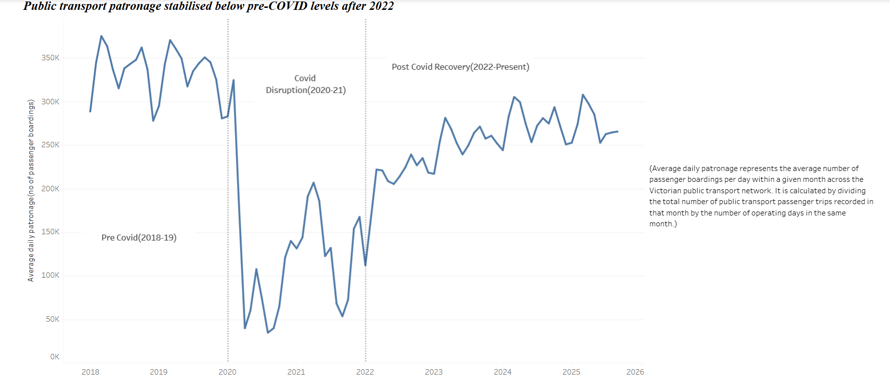
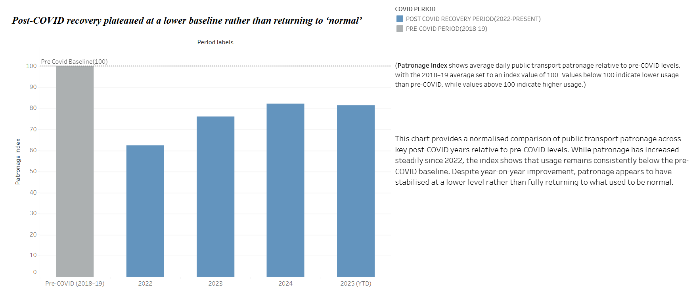
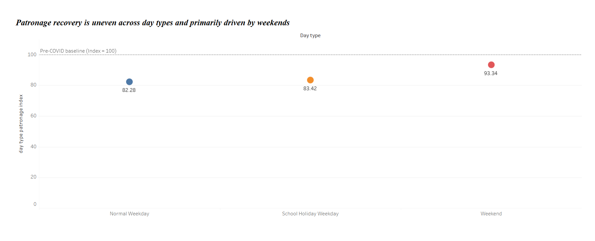
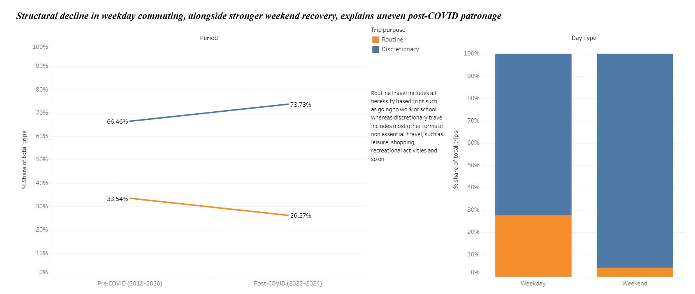
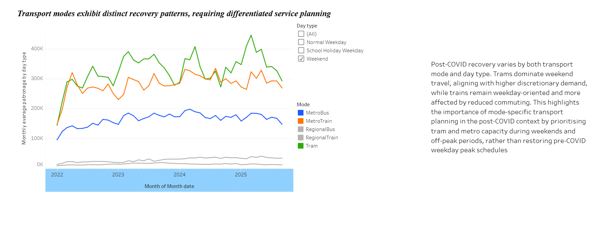

# 🚆 Public Transport Patronage Recovery in Post-COVID Victoria

## Project Overview

This project analyses Victorian public transport patronage trends between 2018 and 2025 to understand how travel behaviour changed following the COVID-19 pandemic and assess the extent of demand recovery across the network.

Using Tableau and SQL-based analysis, the project explores recovery patterns across transport modes, weekdays versus weekends, and different time periods to support evidence-based transport planning and service delivery decisions.

---

## Business Problem

The COVID-19 pandemic significantly disrupted public transport usage patterns across Victoria. Understanding whether patronage has returned to pre-pandemic levels and how travel behaviours have evolved is critical for effective service planning, resource allocation and long-term transport investment decisions.

This project was developed to:

* Measure patronage recovery against pre-COVID baselines.
* Analyse changes in travel behaviour over time.
* Compare weekday and weekend recovery trends.
* Identify opportunities for future transport planning.

---

## Dataset

The analysis uses Victorian public transport patronage data covering the period from 2018 to 2025.

The dataset includes:

* Patronage volumes
* Transport modes
* Time periods
* Weekday and weekend usage patterns
* Historical and post-pandemic travel trends

---

## Tools Used

* Tableau
* SQL
* Excel
* Data Visualisation
* Exploratory Data Analysis

---

## Project Workflow

1. Data Collection
2. Data Cleaning and Preparation
3. SQL Analysis
4. Tableau Dashboard Development
5. Trend Analysis
6. Business Recommendations

---

## Key Findings

* Public transport patronage stabilised at approximately **84% of pre-COVID levels**.
* Weekend travel recovered more strongly than weekday commuting.
* Recovery patterns varied across transport modes and time periods.
* Long-term changes in commuting behaviour suggest increased workplace flexibility and hybrid work arrangements.

---

## Dashboard Preview

### Executive Dashboard

### Patronage Recovery Trends

### Weekday vs Weekend Analysis

---

## Business Recommendations

* Align service planning with evolving travel demand patterns.
* Continue monitoring long-term patronage recovery trends.
* Consider stronger support for weekend services where demand recovery has been strongest.
* Use patronage insights to optimise service allocation and future infrastructure investment.

---

## Dashboard Access

The interactive Tableau dashboard can be viewed here:

[View Interactive Tableau Dashboard](https://public.tableau.com/app/profile/anupama.shaji/viz/FINALSUBMISSION_PUBLICTRANSPORTPATRONAGEINPOST-COVIDVICTORIA_DASHBOARD/Dashboard1?publish=yes)

---

## Author

**Anupama Shaji**

Master of Information Systems | Data Analytics | Business Intelligence

